# Aethelgard 2D: Custom Top-Down MMORPG Engine

[](https://www.typescriptlang.org/)
[](https://developer.mozilla.org/en-US/docs/Web/API/CanvasRenderingContext2D)
[](https://developer.mozilla.org/en-US/docs/Web/API/Web_Audio_API)
[](https://vitest.dev/)
[](src/core/GameLoop.ts)
[](src/ecs/World.ts)
[](#-tech-stack--standar-kualitas)
[](https://azyte.github.io/browser-2d-platformer/)
[](LICENSE)

> Custom 2D MMORPG Engine yang dibangun dari nol (*from scratch*) berbasis **TypeScript** murni dan **HTML5 Canvas 2D Context API** tanpa bantuan game framework pihak ketiga (tanpa Phaser, tanpa PixiJS, tanpa Babylon, dan tanpa Unity).
> 
> Dikembangkan sebagai proyek portofolio teknis untuk seleksi **Google Developer Group on Campus (GDGoC) Universitas Gunadarma (Jalur Hacker)**.

🎮 **Live Demo Web (GitHub Pages)**: [https://azyte.github.io/browser-2d-platformer/](https://azyte.github.io/browser-2d-platformer/)  
📦 **Test Suite Coverage**: **19 Test Files, 89 Unit Tests (100% Passing)**  
⚡ **Target Performance**: Stabil **60 FPS** dengan puluhan entitas simultan pada perangkat desktop dan mobile.

---

## 📑 Daftar Isi

1. [Ikhtisar Proyek & Filosofi Desain](#-ikhtisar-proyek--filosofi-desain)
2. [Diagram Arsitektur Sistem (Mermaid)](#-diagram-arsitektur-sistem)
3. [Fondasi Matematika & Algoritma Engine](#-fondasi-matematika--algoritma-engine)
   - [Fixed Timestep 60Hz & Render Alpha Interpolation](#1-fixed-timestep-60hz--render-alpha-interpolation)
   - [Normalisasi Vektor Pergerakan Diagonal](#2-normalisasi-vektor-pergerakan-diagonal)
   - [Axis-Separated AABB Sliding Collision & Minimum Translation Vector](#3-axis-separated-aabb-sliding-collision--minimum-translation-vector)
   - [Dynamic 2.5D Depth Y-Sorting](#4-dynamic-25d-depth-y-sorting)
   - [Formula Kalkulasi Tempur & Mitigasi Armor](#5-formula-kalkulasi-tempur--mitigasi-armor)
   - [Radial Lighting Masking (Canvas destination-out)](#6-radial-lighting-masking-canvas-destination-out)
4. [Hasil Audit Codebase & Pembersihan Dead Code](#-hasil-audit-codebase--pembersihan-dead-code)
5. [Bedah 14 Sistem Inti Engine](#-bedah-14-sistem-inti-engine)
6. [Skema Kontrol Pemain (Desktop & Mobile)](#-skema-kontrol-pemain)
7. [Struktur Direktori Codebase](#-struktur-direktori-codebase)
8. [Tech Stack & Standar Kualitas](#-tech-stack--standar-kualitas)
9. [Panduan Instalasi & Eksekusi Lokal](#-panduan-instalasi--eksekusi-lokal)

---

## 💡 Ikhtisar Proyek & Filosofi Desain

Proyek ini mendemonstrasikan rekayasa perangkat lunak tingkat rendah (*low-level software engineering*) pada web runtime modern. Alih-alih mengandalkan black-box game engines yang berat, seluruh subsistem fundamental dibangun secara mandiri:

1. **Zero External Game Engine Dependencies**: 100% logika matematika vektor, loop tick fisika, spatial detection, state management, hingga rendering raster diimplementasikan secara langsung di atas primitive API browser.
2. **Data-Oriented Entity-Component-System (ECS)**: Menghindari *polymorphism overhead* dan *deep inheritance trees* dengan memisahkan state data murni (*Components*) dari fungsi pengolah (*Systems*).
3. **Deterministik & Frame-Rate Independent**: Logika fisika dan pertempuran dieksekusi pada frekuensi tetap 60 Hz terlepas dari refresh rate monitor client (60Hz, 120Hz, 144Hz, atau 240Hz).
4. **Procedural Web Audio (Zero Audio Assets)**: Efek suara (ayunan pedang, benturan, whirlwind, konsumsi potion, level up, transaksi toko koin) disintesis secara matematis menggunakan osilator Web Audio API tanpa membutuhkan aset file `.mp3` atau `.wav` eksternal.
5. **Ekonomi RPG Lengkap**: Siklus permainan utuh dengan perolehan gold dari monster & quest yang dapat dibelanjakan ke Pedagang Elric untuk membeli senjata langka, zirah lempeng, dan ramuan cadangan.

---

## 🏛️ Diagram Arsitektur Sistem

Alur kerja engine mengikuti siklus unidirectional yang terstruktur rapi:

```mermaid
flowchart TD
    subgraph InputLayer ["1. Hardware Input & Event Handling"]
        KBD[Keyboard Input]
        MSE[Mouse Coordinates]
        TPD[Virtual Touch Gamepad]
        INP["InputManager (State Cache & Debounce)"]
        KBD --> INP
        MSE --> INP
        TPD --> INP
    end

    subgraph CoreLoop ["2. Core Loop (GameLoop.ts)"]
        RAF["requestAnimationFrame(timestamp)"]
        ACC["Accumulator Pattern (dt = 1/60s)"]
        CLAMP["Spiral of Death Clamp (maxFrameTime = 0.25s)"]
        ALPHA["Alpha Calculation (accumulator / dt)"]
        RAF --> CLAMP --> ACC --> ALPHA
    end

    subgraph ECSWorld ["3. Data-Oriented ECS World (World.ts)"]
        ENT["Entity ID Allocator & Bitmasks"]
        CMP["Component Stores (Sparse Array / Map)"]
        ENT --- CMP
    end

    subgraph SimulationPipeline ["4. Fixed Simulation Tick (60 Hz Deterministic)"]
        DIR["TopDownMovementSystem (Vector Normalization)"]
        COL["Collision & World Boundary System (Sliding MTV)"]
        FSM["MonsterAISystem (Aggro, Patrol, Leash FSM)"]
        BOT["SimulatedMMOPlayerSystem (Autonomous Bots)"]
        NPC["NPCSystem (Proximity & Branching Dialog)"]
        INV["InventorySystem (Bag Grid & Equipment Paperdoll)"]
        SHP["ShopSystem (Merchant Elric & Gold Trading)"]
        CBT["CombatSystem (Hitboxes, Cooldowns, Level-Up)"]
        QST["QuestSystem & LootSystem (Drop Tables & Tracking)"]
        DAY["DayNightCycleSystem (24h Astronomical Clock)"]
        SND["SoundSynthesizer (Web Audio Oscillators)"]

        DIR --> COL --> FSM --> BOT --> NPC --> INV --> SHP --> CBT --> QST --> DAY --> SND
    end

    subgraph RenderPipeline ["5. Multi-Pass Canvas 2D Render Pipeline"]
        CAM["Camera2D (Smooth Lerp Tracking)"]
        P1["Pass 1: Terrain, Roads, Sanctuary Runes, Props"]
        P2["Pass 2: Depth Y-Sorted Sprites (Entities, NPCs, Trees)"]
        P3["Pass 3: Floating Combat Text & Particle Sparks"]
        P4["Pass 4: Day/Night Dynamic Darkness (destination-out Radial Cutout)"]
        P5["Pass 5: Screen-Space HUD, Minimap, Dialog, Bag & Shop Modals"]
        P6["Pass 6: F3 Debug Overlay (AABBs, AI Leash/Aggro Radii)"]

        CAM --> P1 --> P2 --> P3 --> P4 --> P5 --> P6
    end

    INP --> SimulationPipeline
    ACC --> SimulationPipeline
    SimulationPipeline <--> ECSWorld
    SimulationPipeline --> RenderPipeline
    ALPHA --> RenderPipeline
```



---

## 📐 Fondasi Matematika & Algoritma Engine

### 1. Fixed Timestep 60Hz & Render Alpha Interpolation

Game loop memisahkan eksekusi fisika dari refresh rate monitor. Jika monitor berjalan pada 144Hz atau terjadi drop FPS, simulasi dunia tetap stabil dan deterministik:

$$\Delta t = \frac{1}{60} \approx 0.01667 \text{ s}$$

$$\text{accumulator} = \min(\text{accumulator} + \text{frameElapsed}, \text{maxFrameTime})$$

$$\alpha = \frac{\text{accumulator}}{\Delta t} \quad (0 \le \alpha < 1)$$

Visualisasi koordinat saat render diinterpolasi menggunakan faktor $\alpha$:

$$P_{\text{render}} = P_{\text{previous}} \cdot (1 - \alpha) + P_{\text{current}} \cdot \alpha$$

```typescript
// Implementasi pada src/core/GameLoop.ts
while (this.accumulator >= this.targetDt) {
  this.update(this.targetDt);
  this.accumulator -= this.targetDt;
}
const alpha = this.accumulator / this.targetDt;
this.render(alpha);
```

### 2. Normalisasi Vektor Pergerakan Diagonal

Pada pergerakan 8 arah (*top-down*), menekan dua tombol sekaligus (misal W + D) menghasilkan vektor $(1, 1)$ dengan panjang $\sqrt{1^2 + 1^2} = \sqrt{2} \approx 1.4142$ (+41.4% lebih cepat). Engine menormalkan vektor arah ke magnitudo unit $1.0$:

$$\vec{v} = (dx, dy)$$

$$\|\vec{v}\| = \sqrt{dx^2 + dy^2}$$

$$\hat{v} = \begin{cases} \left(\frac{dx}{\|\vec{v}\|}, \frac{dy}{\|\vec{v}\|}\right) & \text{jika } \|\vec{v}\| > 0 \\ (0, 0) & \text{jika } \|\vec{v}\| = 0 \end{cases}$$

$$\vec{v}_{\text{final}} = \hat{v} \cdot \text{speed}$$

```typescript
// Implementasi pada src/rpg/TopDownMovementSystem.ts
const len = Math.hypot(moveX, moveY);
if (len > 0) {
  vel.vx = (moveX / len) * speed;
  vel.vy = (moveY / len) * speed;
} else {
  vel.vx = 0;
  vel.vy = 0;
}
```

### 3. Axis-Separated AABB Sliding Collision & Minimum Translation Vector

Untuk mencegah pemain atau bot tersangkut pada sudut rintangan (pohon, batu granit, bangunan Sanctuary), deteksi dan resolusi tabrakan AABB (*Axis-Aligned Bounding Box*) dipisahkan secara ortogonal pada sumbu $X$ kemudian sumbu $Y$:

```
Posisi Awal -> [Uji Translasi Sumbu X] -> [Resolusi Tabrakan X] -> [Uji Translasi Sumbu Y] -> [Resolusi Tabrakan Y]
```

Karakter dapat meluncur (*smooth wall sliding*) di sepanjang permukaan rintangan walaupun arah gerak diagonal terhambat pada salah satu sumbu:

```typescript
// Resolusi Translasi Sumbu X
transform.x += velocity.vx * dt;
if (checkCollision(entityAABB, obstacleAABB)) {
  transform.x = resolveAxisX(transform.x, obstacleAABB);
  velocity.vx = 0;
}

// Resolusi Translasi Sumbu Y
transform.y += velocity.vy * dt;
if (checkCollision(entityAABB, obstacleAABB)) {
  transform.y = resolveAxisY(transform.y, obstacleAABB);
  velocity.vy = 0;
}
```

### 4. Dynamic 2.5D Depth Y-Sorting

Dalam perspektif ortografis top-down 2D, ilusi kedalaman spasial (*pseudo-3D z-depth*) dicapai dengan mengurutkan urutan render seluruh entitas dinamis dan objek dekorasi dunia berdasarkan koordinat alas kaki (*base Y anchor*):

$$\text{baseY} = y + \text{height}$$

$$\text{Comparator}(A, B) = \text{baseY}_A - \text{baseY}_B$$

- Saat pemain berjalan di atas koordinat alas pohon, pohon digambar belakangan sehingga kanopi daun menutupi kepala pemain.
- Saat pemain melangkah ke bawah koordinat alas pohon, pemain digambar belakangan sehingga berada di depan batang pohon.

```typescript
// Implementasi pada src/rpg/MMORenderSystem.ts
renderables.sort((a, b) => {
  const baseYA = a.transform.y + a.transform.height;
  const baseYB = b.transform.y + b.transform.height;
  return baseYA - baseYB;
});
```

### 5. Formula Kalkulasi Tempur & Mitigasi Armor

Sistem tempur mengkalkulasi pengurangan kerusakan fisik (*damage mitigation*) berbasis status pertahanan:

$$\text{NetDamage} = \max\left(1, \text{Atk}_{\text{attacker}} - \text{Def}_{\text{target}}\right)$$

$$\text{FinalDamage} = \begin{cases} \lfloor \text{NetDamage} \cdot 1.5 \rfloor & \text{jika Critical Hit} \\ \text{NetDamage} & \text{jika Normal Hit} \end{cases}$$

$$\text{WhirlwindDamage} = \lfloor \text{NetDamage} \cdot 2.2 \rfloor \quad (\text{Radius } 75\text{px}, \text{ Area of Effect})$$

Formula progresi EXP per level menggunakan deret pertumbuhan dinamis:

$$\text{EXP}_{\text{next}} = \lfloor 100 \cdot (\text{Level})^{1.35} \rfloor$$

### 6. Radial Lighting Masking (Canvas destination-out)

Siklus 24 jam mengatur warna dan opasitas kegelapan malam (*ambient darkness*). Untuk menghasilkan efek pencahayaan dinamis di sekitar sumber cahaya (obor pemain, lentera bot, api unggun Sanctuary), engine memanfaatkan komposit `destination-out` dengan gradien radial 2-stop:

$$\text{Alpha}(r) = \begin{cases} 1.0 & \text{untuk } r \le r_0 \\ 1.0 - \frac{r - r_0}{r_1 - r_0} & \text{untuk } r_0 < r \le r_1 \\ 0.0 & \text{untuk } r > r_1 \end{cases}$$

```typescript
// Implementasi pada src/rpg/MMORenderSystem.ts
ctx.save();
ctx.fillStyle = `rgba(10, 15, 30, ${ambientDarkness})`;
ctx.fillRect(0, 0, screenWidth, screenHeight);

// Memotong kegelapan malam dengan mode destination-out
ctx.globalCompositeOperation = 'destination-out';
lights.forEach(light => {
  const grad = ctx.createRadialGradient(light.x, light.y, 0, light.x, light.y, light.radius);
  grad.addColorStop(0, 'rgba(0, 0, 0, 1)');
  grad.addColorStop(1, 'rgba(0, 0, 0, 0)');
  ctx.fillStyle = grad;
  ctx.beginPath();
  ctx.arc(light.x, light.y, light.radius, 0, Math.PI * 2);
  ctx.fill();
});
ctx.restore();
```

---

## 🧹 Hasil Audit Codebase & Pembersihan Dead Code

Melalui audit codebase (*technical audit*), dilakukan langkah perapihan arsitektur:

1. **Eliminasi Dead Code Platformer Lawas**: Modul warisan dari prototipe platformer (`PlatformerControllerSystem`, `PlatformerControllerComponent`, dan `SweptAABB`) dihapus secara tuntas dari codebase. Logika tabrakan sekarang 100% menggunakan axis-separated sliding AABB yang didesain khusus untuk perspektif top-down.
2. **Kerapihan Modul & Kohesi**: Menghilangkan sisa file yang tidak terpakai menghasilkan ukuran bundle JavaScript yang lebih kecil, kompilasi TypeScript lebih cepat, dan 100% tes mencerminkan arsitektur aktif saat ini.
3. **Penyempurnaan Ekonomi Game**: Melengkapi kekosongan fungsionalitas gold yang diperoleh dari perburuan dan misi, kini terhubung langsung dengan sistem belanja dan penjualan barang.

---

## 🛡️ Bedah 14 Sistem Inti Engine

| No | Modul / Sistem | Komponen Utama | Deskripsi Teknis & Mekanisme |
| :-: | :--- | :--- | :--- |
| **1** | **Core GameLoop** | `GameLoop.ts` | Pola Fixed Timestep 60Hz dengan render alpha accumulator dan perlindungan spiral of death clamp. |
| **2** | **Type-Safe ECS Engine** | `World.ts`, `Entity.ts`, `Component.ts` | Data-oriented architecture dengan query teroptimasi, batch system execution, dan deferred deletion queue. |
| **3** | **Top-Down Movement** | `TopDownMovementSystem.ts` | Normalisasi vektor 8 arah dan pemisahan sumbu X/Y untuk pergerakan mulus tanpa hambatan sudut. |
| **4** | **Camera 2D System** | `Camera2D.ts` | Smooth linear interpolation (Lerp) kamera pelacak pemain dengan viewport boundary clamping. |
| **5** | **RPG Combat Engine** | `CombatSystem.ts` | Deteksi serangan AABB, cooldown handling, damage mitigation, critical chance, dan auto level-up. |
| **6** | **Monster AI & FSM** | `MonsterAISystem.ts` | State machine musuh (Idle, Patrol, Chase, Attack, Return) dilengkapi mekanisme Anti-Kiting Leash & Respawn Queue. |
| **7** | **Simulated MMO Bots** | `SimulatedMMOPlayerSystem.ts` | 4 bot otonom (Valkyrie, ShadowBlade, Merlin, HealerKun) dengan tingkah laku perburuan monster, auto-potion, dan chat. |
| **8** | **Interactive NPC System** | `NPCSystem.ts` | Tetua Rowan dengan proximity prompt `[F]` dan branching dialog tree berhadiah Blessing of Sanctuary. |
| **9** | **Visual Inventory & Paperdoll** | `InventorySystem.ts` | Grid tas 16 slot, penumpukan item otomatis, slot Weapon/Armor/Accessory dengan kalkulasi stat dinamis. |
| **10** | **Toko & Gold Economy** | `ShopSystem.ts` | Toko Pedagang Elric: Belanja senjata tempaan, zirah lempeng, dan ramuan, serta penjualan item tas seharga 50% harga dasar. |
| **11** | **Day/Night Cycle & Lights** | `DayNightSystem.ts` | Jam astronomis 24 jam dengan 4 transisi fase waktu dan sistem radial light masking `destination-out`. |
| **12** | **Procedural Web Audio** | `SoundSynthesizer.ts` | Sintesis efek suara 16-bit instan tanpa aset audio eksternal (slash, hit, whirlwind, drink, fanfare, koin, transaksi toko). |
| **13** | **Quests & Ground Loot** | `QuestSystem.ts`, `LootSystem.ts` | Pelacakan objektif berhadiah koin & EXP serta item drop fisik (potion, coin pouch, Fenrir Crest) dengan auto-pickup. |
| **14** | **Debug & Touch Controls** | `DebugRenderSystem.ts`, `InputManager.ts` | Overlay visualisasi F3 (hitbox, radar aggro/leash) serta Virtual Touch Gamepad terintegrasi untuk mobile. |

---

## 🎮 Skema Kontrol Pemain

Engine mendukung kontrol desktop ganda (Keyboard & Mouse) serta layar sentuh perangkat mobile secara responsif:

| Aksi | Keyboard Shortcut | Mouse Desktop | Touch Gamepad Mobile | Keterangan |
| :--- | :--- | :--- | :--- | :--- |
| **Gerak 8 Arah** | `W, A, S, D` / `Panah` | - | `Virtual D-Pad (▲ ▼ ◄ ►)` | Normalisasi vektor unit 1.0 |
| **Serangan Dasar** | `Space` / `J` | Klik Kiri Canvas | Tombol `[ATK]` | Ayunan pedang jarak dekat |
| **Whirlwind Slash** | `K` / `1` | - | Tombol `[SKILL]` | Area of Effect 75px, konsumsi 20 MP |
| **Bicara NPC / Toko** | `F` | Klik Banner Dialog | Tombol `[TALK]` | Interaksi Tetua Rowan & Pedagang Elric |
| **Beli Cepat Toko** | `1` s/d `5` | Klik Kartu / `[Beli]` | Ketuk Kartu / `[Beli]` | Pembelian instan item 1-5 di toko pedagang |
| **Jual Barang Tas** | - | Klik `[Jual]` di Toko | Ketuk `[Jual]` di Toko | Menjual item tas seharga 50% harga dasar |
| **Buka/Tutup Tas** | `I` / `B` | Klik Tombol UI `BAG` | Tombol `[BAG]` | Modal Inventaris & Paperdoll |
| **Pilihan Dialog** | `1, 2, 3` | Klik Baris Opsi | Ketuk Baris Opsi | Memilih cabang percakapan |
| **Pasang/Pakai Item** | `1` s/d `8` (di Tas) | Klik Slot Tas | Ketuk Slot Tas | Equip Senjata/Zirah & Minum Potion |
| **Minum Potion HP** | `Q` | - | Tombol `[HP]` | Memulihkan +50 HP instan |
| **Minum Potion MP** | `E` | - | Tombol `[MP]` | Memulihkan +35 MP instan |
| **Tutup Jendela Modal** | `Escape` | Klik Tombol `[X]` | Ketuk Tombol `[X]` | Menutup Dialog, Tas, atau Toko |
| **F3 Debug Visualizer**| `F3` | Klik Tombol `DEBUG` | Ketuk Tombol `DEBUG` | Toggle AABB Hitbox & AI Radar |

---

## 📁 Struktur Direktori Codebase

```
browser-2d-platformer/
├── .github/
│   └── workflows/
│       └── deploy.yml              # CI/CD otomatis build & publish ke GitHub Pages
├── dist/                           # Hasil kompilasi bundle produksi teroptimasi
├── public/                         # Aset publik statis (favicon, manifest)
├── src/
│   ├── audio/
│   │   ├── SoundSynthesizer.ts     # Synthesizer prosedural Web Audio API
│   │   └── SoundSynthesizer.test.ts# Unit test osilator dan modulasi audio
│   ├── core/
│   │   ├── GameLoop.ts             # Fixed timestep loop dengan alpha accumulator
│   │   ├── GameLoop.test.ts        # Unit test kestabilan tick loop
│   │   ├── InputManager.ts         # Handler keyboard, mouse, dan virtual gamepad
│   │   └── InputManager.test.ts    # Unit test mapping tombol dan input buffer
│   ├── ecs/
│   │   ├── Component.ts            # Registri tipe komponen generik
│   │   ├── Entity.ts               # Tipe pengenal entitas unik
│   │   ├── System.ts               # Interface kontrak sistem logika
│   │   ├── World.ts                # Container ECS, query batch, dan lifecycle entitas
│   │   └── World.test.ts           # Unit test registrasi dan iterasi ECS
│   ├── physics/
│   │   ├── AABB.ts                 # Algoritma interseksi Axis-Aligned Bounding Box
│   │   ├── PhysicsComponents.ts    # TransformComponent, VelocityComponent, Collider
│   │   ├── PhysicsSystem.ts        # Integrasi kecepatan dan posisi
│   │   ├── Physics.test.ts         # Unit test matematika fisika
│   │   └── Vector2.ts              # Utilitas operasi vektor 2D
│   ├── render/
│   │   ├── Camera2D.ts             # Kamera 2D berfokus pada target dengan lerp
│   │   ├── Camera2D.test.ts        # Unit test transformasi koordinat kamera
│   │   ├── DebugRenderSystem.ts    # Render AABB dan radar status F3
│   │   └── DebugRenderSystem.test.ts# Unit test toggle debug overlay
│   ├── rpg/
│   │   ├── ChatSystem.ts           # Log percakapan MMORPG interaktif
│   │   ├── CombatSystem.ts         # Mekanika serang, damage mitigasi, level-up
│   │   ├── CombatSystem.test.ts    # Unit test formula kalkulasi kerusakan
│   │   ├── DayNightSystem.ts       # Siklus waktu 24 jam dan ambient color
│   │   ├── DayNightSystem.test.ts  # Unit test fase pencahayaan
│   │   ├── InventorySystem.ts      # Manajemen 16 slot tas dan 3 slot equipment
│   │   ├── InventorySystem.test.ts # Unit test penumpukan item dan bonus status
│   │   ├── LootSystem.ts           # Logika jatuhan ground loot dan auto-pickup
│   │   ├── MMORenderSystem.ts      # Multi-pass renderer (Y-sort, lighting, modals)
│   │   ├── MMORenderSystem.test.ts # Unit test pipeline rendering
│   │   ├── MonsterAISystem.ts      # Finite state machine dan anti-kiting leash
│   │   ├── MonsterAISystem.test.ts # Unit test transisi state AI
│   │   ├── NPCSystem.ts            # Proximity check dan branching dialog tree
│   │   ├── NPCSystem.test.ts       # Unit test alur percakapan NPC
│   │   ├── QuestSystem.ts          # Pelacak misi perburuan dan reward
│   │   ├── QuestAndLoot.test.ts    # Unit test sistem quest dan loot
│   │   ├── RPGComponents.ts        # Definisi komponen spesifik RPG
│   │   ├── RPGComponents.test.ts   # Unit test komponen data
│   │   ├── ShopSystem.ts           # Toko belanja Pedagang Elric & ekonomi gold
│   │   ├── ShopSystem.test.ts      # Unit test transaksi beli & jual barang
│   │   ├── SimulatedMMOPlayerSystem.ts # Otomasi bot pemain simulasi
│   │   ├── SimulatedMMO.test.ts    # Unit test aksi bot mandiri
│   │   ├── TopDownMovementSystem.ts# Normalisasi pergerakan 8 arah
│   │   └── TopDownMovementSystem.test.ts # Unit test kalkulasi vektor
│   ├── index.html                  # Shell canvas aplikasi
│   ├── main.ts                     # Entry point bootstrapping engine
│   └── style.css                   # Tata letak canvas dan tombol kontrol
├── package.json                    # Konfigurasi dependensi dan skrip
├── tsconfig.json                   # Konfigurasi TypeScript mode strict
└── vite.config.ts                  # Konfigurasi bundler Vite
```

---

## 🛠️ Tech Stack & Standar Kualitas

- **Core Programming Language**: **TypeScript 5.x** dengan konfigurasi paling ketat (`strict: true`, `noImplicitAny: true`, `strictNullChecks: true`, `noUnusedLocals: true`, `exactOptionalPropertyTypes: true`).
- **Rendering Technology**: **Native HTML5 Canvas 2D Context API** memanfaatkan multi-pass rasterization, transformasi matriks kamera 2D, sub-pixel interpolasi, dan compositing modes (`source-over`, `destination-out`).
- **Sound Architecture**: **Native Web Audio API** dengan sintesis osilator gelombang (*Sine*, *Sawtooth*, *Square*), gain envelope exponential ramping, dan multi-frequency chords tanpa audio stream eksternal.
- **Unit Testing Framework**: **Vitest** dengan 19 test suite dan 89 unit test komprehensif yang mencakup seluruh kalkulasi matematika, fisika, AI, status RPG, dialog, inventaris, dan toko.
- **Bundler & Build Tool**: **Vite** dengan kompilasi rollup berkecepatan tinggi dan hot-module-replacement (HMR).
- **Deployment Pipeline**: **GitHub Actions CI/CD** yang secara otomatis menguji kode, memvalidasi tipe TypeScript, melakukan kompilasi produksi, dan mendeploy ke **GitHub Pages**.

---

## 🚀 Panduan Instalasi & Eksekusi Lokal

### Prasyarat
- **Node.js**: Versi `>= 18.0.0`
- **npm**: Versi `>= 9.0.0`

### 1. Kloning Repositori
```bash
git clone git@github.com:Azyte/browser-2d-platformer.git
cd browser-2d-platformer
```

### 2. Pasang Dependensi
```bash
npm install
```

### 3. Jalankan Server Development
```bash
npm run dev
```
Buka peramban web pada alamat `http://localhost:5173`.

### 4. Eksekusi Seluruh Unit Test
```bash
npm test
```
Seluruh 19 test suite dan 89 unit test akan dieksekusi secara paralel.

### 5. Kompilasi Produksi (Type-check & Build)
```bash
npm run build
```
Bundle web produksi siap guna akan dihasilkan di dalam folder `dist/`.

---

## 📄 Lisensi

Proyek ini didistribusikan di bawah lisensi terbuka [MIT](LICENSE). Bebas digunakan, dipelajari, dan dikembangkan lebih lanjut untuk keperluan edukasi dan rekayasa perangkat lunak.
